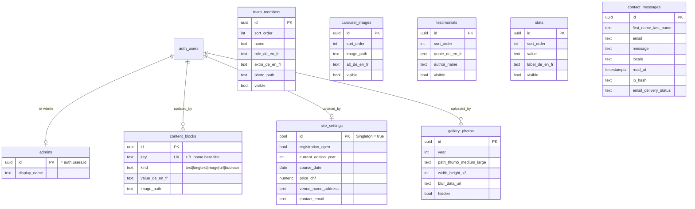

# Datenbank-Schema — improveyourskills.ch

**Stand:** 1. August 2026 · Migrationen in `supabase/migrations/`

Neun Tabellen im Schema `public`, alle mit aktivierter RLS (siehe `docs/RLS.md`).
Zwischen den Inhaltstabellen gibt es bewusst keine Verknüpfungen — jede ist für sich
editierbar. Die einzige Beziehung ist zu Supabases `auth.users` (wer ist Admin, wer hat
zuletzt gespeichert).

## Zweck je Tabelle

| Tabelle | Wofür | Öffentlich sichtbar? |
|---|---|---|
| `admins` | Wer darf bearbeiten (Zuordnung zu Login) | nein |
| `content_blocks` | Alle editierbaren Texte & Bilder (Schlüssel/Wert) | ja (lesen) |
| `team_members` | Die Trainer-Karten | ja (sichtbare) |
| `carousel_images` | Das Über-uns-Karussell | ja (sichtbare) |
| `testimonials` | Zitate (Phase 6) | ja (sichtbare) |
| `stats` | Zahlenband (Phase 6) | ja (sichtbare) |
| `site_settings` | Jahr, Datum, Preis, Anmeldestatus, Ort, Kontakt | ja (lesen) |
| `gallery_photos` | Galerie (Phase 4) | ja (nur nicht-versteckte) |
| `contact_messages` | Kontaktformular-Eingänge (Phase 5) | **nein** (nur Admins) |

## Hilfsfunktionen

- `set_updated_at()` — hält `updated_at` bei jeder Änderung aktuell.
- `is_admin()` — prüft, ob die aktuelle Anfrage von einem Admin kommt (Basis aller
  Schreibrechte).

## Reihenfolge der Migrationen

1. `…172854_initial_schema.sql` — Tabellen + Hilfsfunktionen
2. `…172855_rls_policies.sql` — RLS aktivieren + alle Policies
3. `…152807_seed_content.sql` — die aktuellen Inhalte (idempotent)
